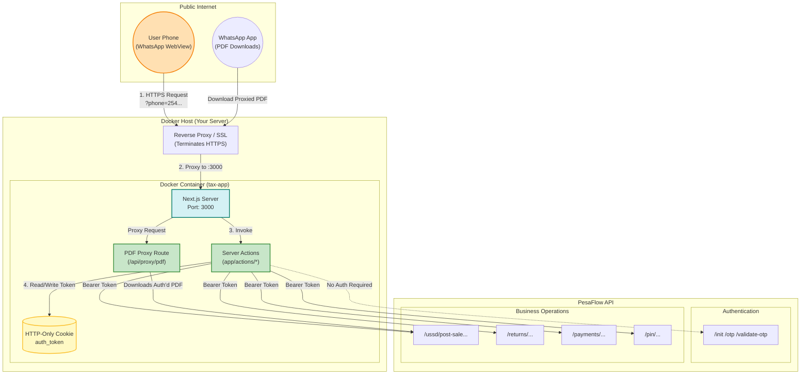
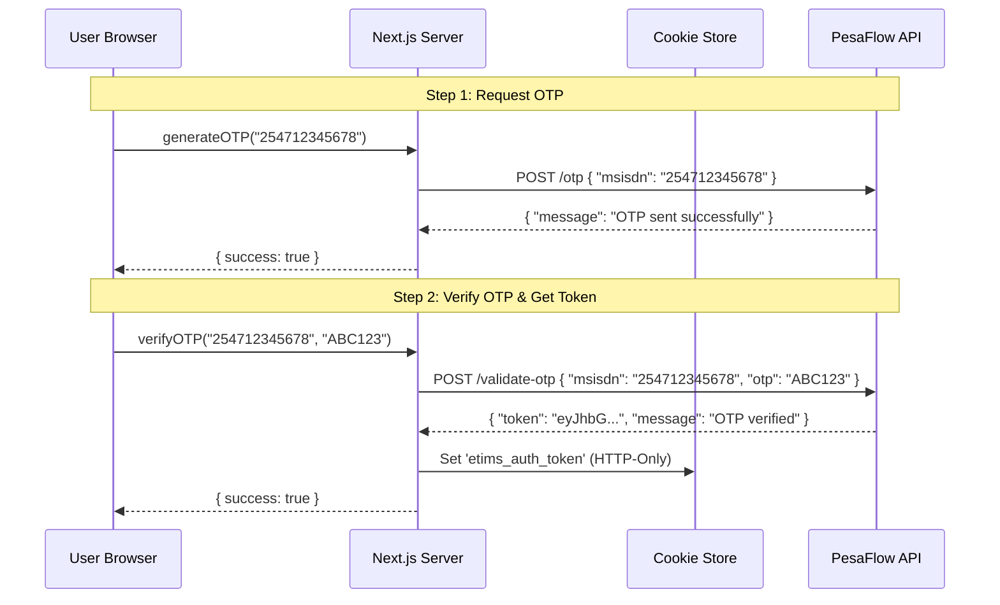
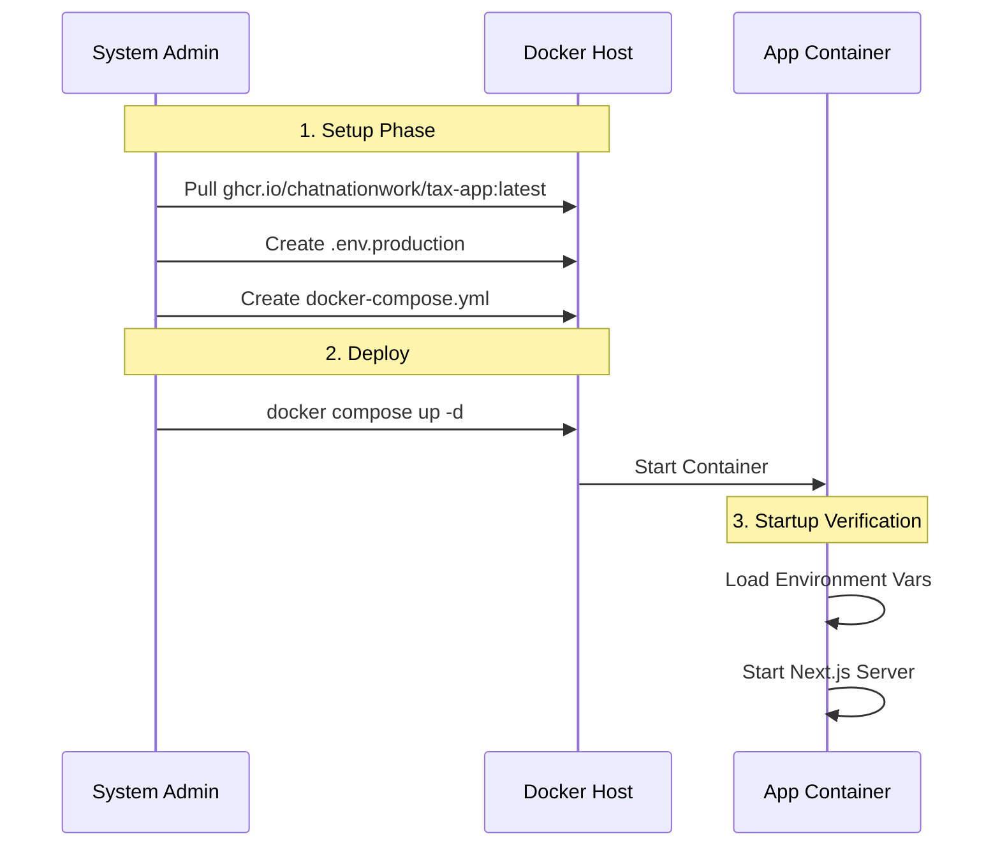

# System Architecture & Docker Deployment Guide

This guide details the system architecture and how to deploy the **KRA WhatsApp Services WebViews (Tax App)** application using Docker and Docker Compose. It consolidates architectural insights, security requirements, and operational steps from our technical documentation.

---

## 1. Project Overview

| Item | Details |
|:-----|:--------|
| **Application Name** | KRA WhatsApp Services WebViews (Tax App) |
| **Technology Stack** | Next.js 16, React 19, TypeScript, TailwindCSS 4 |
| **Delivery Channel** | WhatsApp WebView |
| **Target Users** | All Taxpayers (Individuals, Non-Individuals) |
| **Backend API** | `https://ecitizen.kra.go.ke/api` |
| **Container Format** | Docker Image (Linux/Node.js) |

### Core Features
- **eTIMS** - Create and send tax invoices, credit notes, and buyer-initiated workflows
- **Returns** - File Nil, MRI, and TOT returns
- **Payments** - Process AHL, eSlip, and NITA payments
- **Payroll** - Manage employees, bulk upload, and payroll processing
- **Registration** - PIN Registration & Retrieval
- **Compliance** - Tax Compliance Certificate (TCC) verification

---

## 2. System Architecture

The application operates as a **Secure Gateway** (BFF Pattern) between WhatsApp users and the upstream KRA/PesaFlow APIs. It is designed to be stateless and containerized.

### High-Level Data Flow



### Authentication Flow (OTP → Token)

This diagram shows the login process utilized across all services:



---

## 3. Core API Modules Integrated

All API calls form requests dynamically prepended with `process.env.API_URL`.

| Domain Module | Server Action File | Key Endpoints/Actions Used |
|:--------------|:-------------------|:---------------------------|
| **Auth** | `actions/auth.ts` | `/otp`, `/validate-otp` |
| **eTIMS** | `actions/etims.ts` | `/ussd/post-sale`, `/ussd/credit-note`, etc. |
| **Returns** | `actions/nil-mri-tot.ts` | `/returns/nil`, `/returns/mri`, `/returns/tot` |
| **Payments** | `actions/payments.ts` | Ahl, eSlip, NITA verifications |
| **Payroll** | `actions/payroll.ts` | Bulk upload, employee registry |
| **Registration** | `actions/pin-registration.ts` | Taxpayer registration flows |

### Request Headers
All requests from Server Actions enforce:
```
Authorization: Bearer <auth_token>
x-source-for: whatsapp
x-forwarded-for: whatsapp
Content-Type: application/json
```

---

## 4. WhatsApp Integration

### Notification Types

| Type | Trigger | Purpose |
|:-----|:--------|:--------|
| `etims_invoice` | Sales invoice created | Send Invoice PDF |
| `returns_success` | Return filed | Send acknowledgement |
| `payment_success` | Payment completed | Send eSlip confirmation |

### Secure PDF Proxying
WhatsApp Cloud API cannot download media that requires an authorization token. We serve `app/api/proxy/pdf` to proxy requested PDFs holding a specific token parameter, bypassing this restriction seamlessly for end users.

---

## 5. Security Considerations

| Feature | Implementation |
|:--------|:---------------|
| **HTTP-Only Cookies** | Auth tokens stored in `etims_auth_token` cookie, inaccessible to JavaScript. |
| **Server-Side Secrets** | API keys and base URLs are only available on the server (`process.env`). |
| **Proxy Masking** | PesaFlow API structure natively hidden behind the Next.js API/actions proxy layer. |
| **Token Injection** | All upstream API requests are authenticated cleanly server-side in `app/actions/`. |

---

## 6. Deployment Artifacts & Prerequisites

### Required Software
*   **Docker Engine**: (v20.10+)
*   **Docker Compose**: (v2.0+)

### Environment Variables
Create a `.env.production` file. 

| Variable | Description | Example Value |
| :--- | :--- | :--- |
| `API_URL` | Base URL for the upstream API. | `https://kratest.pesaflow.com/api` |
| `NEXT_PUBLIC_APP_URL` | The public URL of the application. | `https://taxObj.chatnation.co.ke` |
| `WHATSAPP_PHONE_NUMBER_ID` | Meta Business ID for the phone number. | `5896221609...` |
| `WHATSAPP_ACCESS_TOKEN` | System User Token with messaging permissions. | `EAA...` |
| `NEXT_PUBLIC_WHATSAPP_NUMBER` | The display number (no `+` sign). | `254708427694` |
| `HOST_PORT` | The external port to expose the app on. | `3000` |

---

## 7. Operational Workflow



---

## 8. Step-by-Step Deployment Instructions

### **Method: Using Pre-built Image (Recommended)**

#### Step 1: Prepare the Environment
```bash
mkdir tax-app
cd tax-app
```

#### Step 2: Configure Secrets
```bash
nano .env.production
# Paste the variables listed in Section 6
```

#### Step 3: Pull and Run the Service
```bash
# Pull the latest image
docker pull ghcr.io/chatnationwork/tax-app:latest

# Run the container with environment variables
docker run -d \
  -p 3000:3000 \
  --name tax-app \
  --env-file .env.production \
  --restart always \
  ghcr.io/chatnationwork/tax-app:latest
```

#### Step 4: Verify Deployment
```bash
# Check if container is running
docker ps

# View application logs
docker logs -f tax-app

# Test the application
curl http://localhost:3000/
```

---

## 9. File Structure

```
tax/
├── app/
│   ├── _components/      # Shared UI components
│   ├── _lib/             # Shared utilities (analytics, etc.)
│   ├── actions/          # Server actions for all modules
│   ├── api/              # Next.js API routes (PDF proxy, webhooks)
│   ├── etims/            # eTIMS pages
│   ├── nil-mri-tot/      # Returns pages
│   ├── payments/         # Payments pages
│   ├── payroll/          # Payroll pages
│   ├── pin-registration/ # PIN Reg pages
│   ├── tcc/              # TCC pages
│   └── ...               # (Other routes)
├── docs/                 # Documentation (Guides, Arch rules)
├── scripts/              # Internal utility scripts
├── Dockerfile            # Container build instructions
├── docker-compose.yml    # Docker Compose definition
└── package.json          # Dependencies
```
